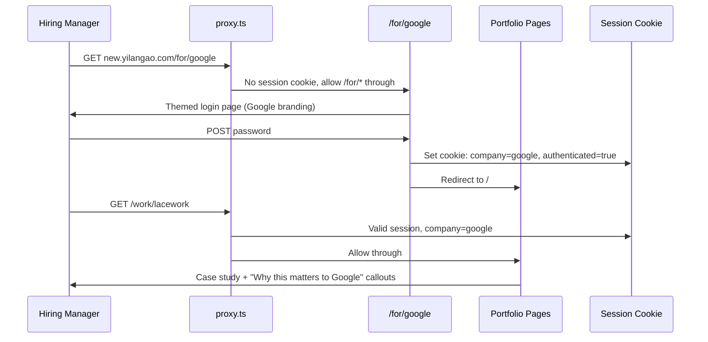

# Company-Personalized Password Gate

## How it works




## Data model: Company config

A JSON config file at `src/config/companies.json` defines all known companies. No CMS or database needed — this is a small, hand-curated list that changes when you're actively job hunting.

```json
{
  "google": {
    "name": "Google",
    "password": "goog-preview-2026",
    "theme": {
      "accent": "#4285F4",
      "greeting": "Hi, Google team"
    },
    "caseStudyNotes": {
      "lacework": "This cloud security redesign mirrors the complexity of Google Cloud Console...",
      "meteor": "The trust calibration framework parallels challenges in Google's ML tooling..."
    }
  }
}
```

- `password` — unique per company, validated server-side
- `theme` — drives the login page appearance (accent color, greeting text, optional logo)
- `caseStudyNotes` — pre-written relevance notes keyed by project slug, displayed as callout blocks in case studies

Future extension: add an `aiNotes: true` flag per company to trigger live AI generation instead of static text. The component that renders the callout doesn't care where the text comes from.

## Files to create or modify

### 1. `src/proxy.ts` (new file)

Next.js 16 proxy — runs before every request, server-side only.

Logic:

- If path starts with `/for/` — allow through (this is the login page)
- If path starts with `/admin` or `/api` — allow through (Payload CMS needs access)
- If path is a static asset (`/_next/`, `/images/`, `/favicon.ico`) — allow through
- Otherwise: check for a `portfolio_session` cookie
  - If valid cookie exists — allow through, set `x-company` header for downstream use
  - If no cookie — redirect to `/for/unknown` (generic login page)

### 2. `src/app/(frontend)/for/[company]/page.tsx` (new file)

Server component that:

- Reads the `[company]` param
- Looks up company config from `companies.json`
- If company not found, falls back to a generic unbranded login
- Passes company theme data to the client component

### 3. `src/app/(frontend)/for/[company]/LoginClient.tsx` (new file)

Client component — the actual login form:

- Styled based on the company theme (accent color, greeting, optional subtle brand nod)
- Single password field + submit button
- Calls a server action to validate
- On success, redirects to `/`
- On failure, shows an error message

This is where the design experiment lives. The page should feel curated, minimal, and intentional — like a personal invitation, not a security barrier.

### 4. `src/app/(frontend)/for/[company]/actions.ts` (new file)

Server action `validatePassword(company: string, password: string)`:

- Loads company config
- Compares password (constant-time comparison to prevent timing attacks)
- If valid: sets an HTTP-only, secure, SameSite=Lax cookie (`portfolio_session`) containing the company slug (signed with `PAYLOAD_SECRET` or a dedicated `SESSION_SECRET`)
- Returns success/failure

### 5. `src/config/companies.json` (new file)

The company config as described above. Start with 1-2 companies to test, add more as you apply.

### 6. `src/lib/company-session.ts` (new file)

Utility functions:

- `getCompanyFromSession(cookies)` — reads and verifies the session cookie, returns company slug or null
- `setCompanySession(company)` — creates the signed cookie value
- `clearCompanySession()` — for a future logout action

### 7. Modify `src/app/(frontend)/work/[slug]/page.tsx`

After the existing project data fetch, also:

- Read the company session from cookies
- Look up `caseStudyNotes[slug]` for that company
- Pass the note text (if any) to `ProjectClient` as a new `companyNote` prop

### 8. Modify `src/app/(frontend)/work/[slug]/ProjectClient.tsx`

Add a callout/aside component that renders `companyNote` when present. This should be a visually distinct block — perhaps a subtle highlighted aside with a brief "Why this matters to [Company]" heading. Positioned near the top of the case study, after the hero section.

### 9. `.env` update

Add `SITE_PASSWORD` as a fallback/generic password (for the `/for/unknown` route or direct `/` access). Add `SESSION_SECRET` for cookie signing (can reuse `PAYLOAD_SECRET` if you prefer fewer env vars).

### 10. Vercel env var

Add `SESSION_SECRET` (or reuse `PAYLOAD_SECRET`) in Vercel dashboard.

## What's NOT in scope (future extensions)

- **Live AI note generation** — the `companyNote` rendering component is the same regardless of source. When you want AI generation, add an API route that generates + caches notes per company/slug pair, and call it from the case study page when `caseStudyNotes[slug]` is empty but `aiNotes` is enabled.
- **Analytics per company** — could track which case studies each company views. Not building this now, but the company session cookie makes it trivial to add later.
- **Expiring passwords** — could add `expiresAt` to the company config. Not needed now.

## Phase 0: Backfill deployment documentation (from initial new.yilangao.com launch)

The deployment to `new.yilangao.com` completed successfully but the engineering feedback loop was not fully closed. These documentation gaps must be filled before starting the password gate work.

### 0a. Engineering feedback log (`docs/engineering-feedback-log.md`)

- Fix stale header: update "Last updated" from "2026-04-01 (ENG-088)" to current date and latest ID
- Add **ENG-096**: Vercel build failures on first deploy of main site
  - Issue: Two `Module not found` errors — (1) `importMap.js` was in `.gitignore` so Payload's generated admin map didn't reach GitHub; (2) `resend` was dynamically imported but not in `package.json`, Turbopack resolves all imports at build time
  - Root cause: Local-only generated files and optional-dependency patterns that work in dev but break in CI/CD
  - Resolution: Removed `importMap.js` from `.gitignore` and committed it; added `resend` to `package.json`; removed `@ts-expect-error`

### 0b. Engineering anti-patterns (`docs/engineering-anti-patterns.md`)

- Add **EAP-060**: "Gitignored files that Vercel needs at build time" — generalizable pattern: if a framework generates a file locally that the build depends on, it must be committed. `importMap.js` is the canonical example. Check: does `next build` fail in a clean checkout?

### 0c. Release log (`docs/release-log.md`)

- Add **REL-002**: Main site deployed to `new.yilangao.com` — first production deployment of the portfolio. Include: Vercel project `yilangao-portfolio`, build fix commit, DNS setup via Cloudflare CNAME.

### 0d. Engineering frequency map (`docs/engineering.md` Appendix)

- Add or update row for "Deployment / Vercel build" category with ENG-096 reference

---

## Phase 3: Knowledge system integration

After the password gate code is implemented and deployed, integrate the new system into the project's documentation and agent skill structure.

### 3a. Create `.cursor/skills/password-gate/SKILL.md`

Full architecture reference that an agent reads before modifying any password gate file. Covers:

- **System overview**: proxy.ts intercepts all requests; `/for/[company]` is the login route; session cookie carries company identity; case studies render personalized notes
- **Data flow**: URL → proxy check → login page (themed) → server action validates → cookie set → site renders with company context → case study notes injected
- **Company config schema**: JSON structure in `src/config/companies.json`, how to add a new company, field descriptions
- **Session cookie mechanics**: signing with `SESSION_SECRET`, cookie name `portfolio_session`, HTTP-only/Secure/SameSite=Lax
- **Login page theming**: how `theme.accent` and `theme.greeting` drive the UI, where the client component lives
- **Case study notes**: how `caseStudyNotes` map to project slugs, where the callout renders in `ProjectClient`
- **Future AI extension**: the `aiNotes` flag pattern, where to add the generation endpoint
- **Testing protocol**: how to verify the gate after changes (clear cookie, visit `/`, confirm redirect; enter password, confirm access; check case study notes)
- **Env vars**: `SESSION_SECRET` required in both `.env` and Vercel

Metadata for skill activation:

- `filePattern`: `src/proxy.ts`, `src/config/companies.json`, `src/lib/company-session.ts`, `src/app/(frontend)/for/`**
- `bashPattern`: password, company, session, proxy

### 3b. Create `.cursor/rules/password-gate.md`

File-scoped rule with glob: `src/proxy.ts`, `src/config/companies.json`, `src/app/(frontend)/for/`**

Content: "STOP — read `.cursor/skills/password-gate/SKILL.md` before making any changes. The password gate is a security boundary; changes to proxy.ts, company config, or the login flow affect all visitor access."

### 3c. Update `docs/architecture.md` — new Section 4.x

Add **"Visitor Access Control"** after the existing deployment sections:

- The `/for/[company]` URL pattern and why it was chosen (clean shareable URLs, company pre-theming)
- The proxy.ts gate: what it allows through (login routes, admin, API, static assets) and what it blocks
- Session cookie lifecycle: set on login, read on every request, signed to prevent forgery
- Company personalization: config-driven theme on login page, case study relevance notes
- Security properties: server-side only, no content leaks, Payload admin exempt

### 3d. Update `docs/engineering/deployment.md`

- Add `SESSION_SECRET` to the Environment Variables (Main Site) table
- Add note: "proxy.ts must be present for the password gate to function — if removed, all pages become publicly accessible"

### 3e. Update `AGENTS.md` — new Hard Guardrail

Add to Engineering guardrails: "NEVER modify `src/proxy.ts`, `src/config/companies.json`, or `src/lib/company-session.ts` without first reading `.cursor/skills/password-gate/SKILL.md`. These files form the visitor access boundary — incorrect changes can expose the site publicly or lock out all visitors."

### 3f. Update checkpoint and ship-it skills

Both skills reference Vercel deployment but don't know about `new.yilangao.com` or the project mapping. Add a brief cross-reference:

- "See AGENTS.md App Registry for production URLs and Vercel project names. The main site deploys to `yilangao-portfolio` (root dir `.`), the playground to `yilangao-design-system` (root dir `playground/`). `.vercel/project.json` at repo root links to the playground, not the main site."

---

## Security properties

- **Server-side only**: `proxy.ts` blocks all unauthenticated requests before any page content is generated or sent. No HTML, CSS, or JS leaks through.
- **Signed cookies**: The session cookie is signed, so visitors can't forge a company identity by editing cookies.
- **No source exposure**: Company passwords are in a JSON config file on the server — never sent to the client. The login form POSTs to a server action.
- **Payload admin exempt**: `/admin` and `/api` routes bypass the password gate entirely (Payload has its own auth).

