# Orchestrator Architecture v3.2 — Final (Implemented)

> **Status:** Fully implemented. All skill files, AGENTS.md modifications, and iteration skill addenda are live.
> **Implementation files:** `.cursor/skills/orchestrator/` (hub + 5 spokes), `AGENTS.md`, 3 iteration skills, `.cursor/skills/orchestrator/future-langgraph.md`

## Final Design Decisions

- **Activation**: 3+ distinct tasks, OR 2 distinct tasks where at least one involves creating a new component/page/collection from scratch. Single-task-multi-category feedback stays with one agent (existing Step 0 handles it). Single-category 2-task requests that are both small edits stay with one agent.
- **AGENTS.md conflict**: Double override via `[ORCHESTRATED]` marker (top of AGENTS.md + inside Pre-Flight + inside each skill's cross-category check).
- **Pre-Flight scope**: When orchestrator activates, only Step 0 runs. Routes 1-12 do NOT run. The orchestrator handles all routing, skill assignment, and gate identification internally.
- **Parallelism**: Moderate — parallelize tasks with non-overlapping write-files, reconcile after. Pre-assigned IDs eliminate same-category race conditions, so same-category tasks CAN run in parallel if their files don't overlap.
- **Gates**: Orchestrator identifies gates via file-path rules during decomposition. Gates run as a sequential last step after all implementation. Future evaluator agent will take this over.
- **Documentation**: Orchestrator pre-assigns log entry IDs before dispatching. Helpers write a 2-line stub BEFORE implementation (matching EAP-027). Helpers include full draft in their response. Orchestrator enriches stubs into official entries. If orchestrator fails, stubs remain as breadcrumbs + next session catches up.
- **Server operations**: Helpers report "server restart needed" instead of doing it. Orchestrator batches and runs all server ops once after implementation, before gates.
- **Task tracking**: Uses built-in TodoWrite tool.
- **Skill structure**: Hub and spoke.
- **Decision gate**: After decomposition and ID assignment, if any task is high-risk or ambiguous, surface a concise decision-only question to the user before dispatching. Otherwise proceed directly.
- **Evaluator**: Interface hook in Phase 4; full design deferred to a dedicated session. Design risk note: evaluator must be lightweight/time-bounded (< 30s) per Cursor scaling-agents research.
- **LangGraph**: Explored as future migration path. Prompt-based chosen for now due to Cursor platform constraints. Documented at `.cursor/skills/orchestrator/future-langgraph.md`.

---

## Revised Flow

```mermaid
flowchart TD
    UserMsg["User message"] --> Step0["Step 0: Classify categories\n+ multi-task check"]
    Step0 --> MultiTask{"3+ tasks, or\n2 tasks with creation?"}
    MultiTask -->|No| Normal["Normal single-agent flow\n(Pre-Flight routes 1-12\nrun as usual)"]
    MultiTask -->|Yes| OrcHub["Orchestrator activates\n(routes 1-12 skipped)"]
    OrcHub --> Escalation{"Check feedback logs:\nrecurring pattern?"}
    Escalation -->|Yes| Reframe["Reframe as architectural\ndiagnosis"]
    Escalation -->|No| Decompose
    Reframe --> Decompose["Decompose: parse tasks,\npredict files, identify\ngates via path rules"]
    Decompose --> PreAssign["Pre-assign log IDs\n+ build dependency graph"]
    PreAssign --> Decision{"User decision\nneeded?"}
    Decision -->|Yes| AskUser["Surface decision-only\nquestion"]
    Decision -->|No| Dispatch
    AskUser --> Dispatch["Dispatch helpers with\nORCHESTRATED marker +\npre-assigned IDs"]
    Dispatch --> Parallel["Parallel group\n(non-overlapping files)"]
    Dispatch --> Sequential["Sequential group\n(data dependencies)"]
    Parallel --> Collect["Collect results +\ndraft docs + file lists"]
    Sequential --> Collect
    Collect --> ServerOps{"Server ops\nneeded?"}
    ServerOps -->|Yes| BatchServer["Batch all server\nrestarts + sync scripts"]
    ServerOps -->|No| Gates
    BatchServer --> Gates["Run gates sequentially\n(identified during decompose)"]
    Gates --> GateResult{"Gates pass?"}
    GateResult -->|"Needs follow-up"| FollowUp["Dispatch follow-up\nhelpers for gate work"]
    GateResult -->|Pass| Reconcile
    FollowUp --> Reconcile["Reconciliation pass\n(git diff + import check)"]
    Reconcile --> Issues{"Issues?"}
    Issues -->|Small| SelfHeal["Fix silently"]
    Issues -->|Big| PauseUser["Pause + ask user"]
    Issues -->|None| DocSynth
    SelfHeal --> DocSynth["Enrich doc stubs\ninto official entries\nwith correlation IDs"]
    PauseUser --> Dispatch
    DocSynth --> Verify["Verification pass:\noriginal request vs\ncompleted work"]
    Verify --> Report["Report to user"]
```




**Future evaluator hook**: The evaluator will plug in between "Collect" and "Gates" — replacing the simple collection step with a quality assessment that can kick tasks back to helpers. The gate step may also move into the evaluator. For now, both are handled by the orchestrator directly.

---

## File Changes

### 1. New: Hub — `.cursor/skills/orchestrator/SKILL.md` (~80 lines)

```markdown
# Skill: Orchestrator

## When to Activate
Activate when Step 0 detects:
- 3+ distinct tasks, OR
- 2 distinct tasks where at least one involves creating a new component, page, or CMS collection from scratch.

Do NOT activate for:
- Single-task-multi-category feedback (Step 0 handles it with existing routing)
- 2 small edit tasks (single agent handles these faster)

## Phase Index
| Phase | What | Detail file | When |
|-------|------|-------------|------|
| 1 | Escalation check | (inline) | Always |
| 2 | Decompose + plan | orchestrator/decompose.md | Always |
| 3 | Dispatch | orchestrator/dispatch.md | Always |
| 4 | Collect + server ops + gates | orchestrator/collect.md | After helpers return |
| 5 | Synthesize docs | orchestrator/document.md | After gates pass |
| 6 | Verify + report | (inline) | Always |

## Phase 1: Escalation Check (inline)
Read last 15 lines of each applicable feedback log (all categories that appear
across the user's tasks). Also read the frequency map appendix in
engineering.md / design.md / content.md.
If current task matches a pattern with 2+ hits (eng) or 3+ hits (design/content):
reframe the task from "fix X" to "diagnose architectural root cause of X."

## Between Phase 2 and Phase 3: Pre-Assign IDs
After decomposition identifies the discrete tasks and their categories,
pre-assign the next available log entry IDs (e.g., FB-070, ENG-074, CFB-021).
Read the latest entry in each relevant log to determine the next ID.
Pass these IDs to helpers in Phase 3 dispatch.

## Between Pre-Assign IDs and Phase 3: Decision Check (inline)
After decomposition and ID assignment, check: does any task involve high risk
(new architecture, unfamiliar pattern) or ambiguity (unclear user intent,
multiple valid approaches)?
- If NO: proceed directly to Phase 3 dispatch.
- If YES: surface a concise, decision-only question to the user before
  dispatching. Keep it to one question with 2-3 options. Do not present the
  full decomposition — only the decision that blocks dispatch.
  After the user responds, proceed to Phase 3.

## Phase 6: Verify + Report (inline)
Re-read user's original message. For each distinct request, confirm a helper
addressed it. If anything was dropped, dispatch a remediation helper.
Report to user: concise summary of what was done (not how). Format:
- One bullet per completed task
- Any issues encountered and how they were resolved
- Any items that need user attention

## Future: Evaluator Hook

Phase 4 currently handles collection, server ops, and gates directly.
A future evaluator agent will take over quality assessment, testing, and gate
checks. Design the evaluator to receive helper results + file change manifests
and return approve/rework decisions. See [placeholder: orchestrator/evaluator-interface.md].

**Design risk (from Cursor's scaling-agents research):** Cursor found that an
integrator role for quality control and conflict resolution "created more
bottlenecks than it solved" at scale. At our scale (3-5 helpers, minutes not
weeks), the bottleneck risk is lower, but the evaluator should be designed as
a lightweight, time-bounded pass — not a blocking gate that re-reviews every
file. If it can't complete in under 30 seconds, reconsider the design.
See: https://cursor.com/blog/scaling-agents
```

### 2. New: Spoke — `.cursor/skills/orchestrator/decompose.md`

How to parse a user message into discrete tasks:

- **Signals for distinct tasks**: numbered lists, "and then", "also", comma-separated, session agendas ("today I want to..."), multiple sentences about different screens/features
- **NOT distinct tasks**: single feedback touching multiple categories (Step 0 handles this)
- For each task: identify category, predict read/write files, determine risk level
- **Dependency rules**:
  - Parallel ONLY if write-file sets don't overlap
  - Same-category tasks CAN run in parallel (pre-assigned IDs prevent stub collisions)
  - If Task B reads a file Task A writes, B waits for A
  - Checkpoint and doc-audit tasks MUST run last and exclusively (they touch the entire repo or all doc files)
  - Tasks requiring server restart are flagged (helpers report, don't restart)
  - Documentation is always handled by the orchestrator, never helpers

**Gate identification table** (replaces Pre-Flight routes 9/10/12 for orchestrated work):


| Task writes to                              | Gate that applies     | Gate skill file                            |
| ------------------------------------------- | --------------------- | ------------------------------------------ |
| `src/components/ui/`* or `src/components/`* | Cross-app parity      | `.cursor/skills/cross-app-parity/SKILL.md` |
| `src/globals/`* or `src/collections/`*      | CMS parity            | `.cursor/skills/cms-parity/SKILL.md`       |
| `playground/src/app/components/`*           | Playground validation | `.cursor/skills/playground/SKILL.md`       |
| `src/styles/tokens/`*                       | Token sync            | Run `npm run sync-tokens` (server op)      |


These gates are NOT sent to helpers. The orchestrator runs them in Phase 4 after implementation.

### 3. New: Spoke — `.cursor/skills/orchestrator/dispatch.md`

**Pre-Dispatch Decision Check**: Before building context packages, confirm the decision check from the hub has passed. Do not dispatch helpers until all blocking decisions are resolved.

**Context package template** — every helper receives:

1. The `[ORCHESTRATED]` marker (first line of dispatch prompt)
2. The specific task description (scoped, not full user message)
3. The skill file(s) to follow (orchestrator determines these during decomposition)
4. Specific files to read before starting
5. File boundary: "You may modify: [list] and your designated feedback log file. Do not modify anything else."
6. Server ops instruction: "If your work requires a server restart or sync script, include `## Server Operations Needed` in your response listing what's needed. Do NOT run them yourself."
7. **Pre-assigned log ID + stub-first instruction**: "Your log entry ID is `ENG-074`. BEFORE starting implementation, write a 2-line stub to the feedback log (e.g., `docs/engineering-feedback-log.md`): the entry header (`#### ENG-074: '[task title]'`) and `**Resolution pending (orchestrated)`**. This stub must exist before you write any code (per EAP-027). After implementation, include a full `## Draft Documentation` section in your response with the complete entry using this same ID."
8. File manifest instruction: "Include a `## Files Modified` section listing every file you created or changed."
9. Success criteria for this specific task
10. The Hard Guardrails section from AGENTS.md (or a reminder that they apply via workspace rules)

**Helper type mapping**:


| Task type                     | subagent_type  | Model   | Flags          |
| ----------------------------- | -------------- | ------- | -------------- |
| Implementation (code changes) | generalPurpose | default |                |
| Exploration / diagnosis       | explore        | fast    | readonly: true |
| Browser verification          | browser-use    | default |                |
| Shell commands / git ops      | shell          | fast    |                |


**TodoWrite**: Create checklist before dispatching. Update as helpers return.

### 4. New: Spoke — `.cursor/skills/orchestrator/collect.md`

After helpers return:

**Step 1: Collect**

- Read each helper's response
- Extract `## Files Modified`, `## Server Operations Needed`, and `## Draft Documentation` sections
- Update TodoWrite checklist

**Step 2: Batch server operations**

- Before running any server operation, read `docs/port-registry.md` (Hard Guardrail #6) and check what's running on the relevant ports
- If any helper reported server ops needed, run them now (sequentially, never in parallel)
- `npm run sync-tokens` if token files were modified
- Restart dev server if CMS schema was modified
- Wait for the server to be healthy before proceeding to gates

**Step 3: Run gates**

- Check which gates apply based on what was modified (from file manifests):
  - Files in `src/components/ui/` -> cross-app parity gate
  - CMS schema files -> CMS parity gate
  - Playground component pages -> playground validation checklist
- Run each gate sequentially. If a gate requires follow-up work (e.g., "create playground page"), dispatch a new helper for that specific task.
- After all follow-up helpers return, re-scan every newly modified file against the gate identification table. If a follow-up introduced files matching a gate that hasn't run yet, run that gate now. Repeat until no new gates are triggered.

**Step 4: Reconciliation**

- Run `git diff --name-only` to get the actual list of all modified files
- Check files that import from other modified files -- verify no broken references
- **Recovery classification**:
  - Small (self-heal): linter errors, missing imports, stale references
  - Big (pause + ask): contradicts user intent, gate failed and can't be auto-resolved, helper went outside boundary
  - **Circuit breaker**: max 1 remediation attempt per failed task. If the remediation helper also fails, stop re-dispatching, report the failure to the user in Phase 6, and move on.

**Future**: Steps 3-4 will be replaced by the evaluator agent.

### 5. New: Spoke — `.cursor/skills/orchestrator/document.md`

**Step 1: Enrich stubs**

- Each helper wrote a 2-line stub in the correct log. Collect all draft entries from helper responses.
- For each draft: replace the stub with the full entry (matching by entry ID)

**Step 2: Correlation ID**

- Assign a shared correlation ID (ORC-NNN) to all entries from this session
- Add `**Orchestration:** ORC-NNN` to each enriched log entry

**Step 3: Cross-references**

- Add cross-category notes between related entries (e.g., "Also documented as ENG-074")

**Step 4: Update knowledge base**

- Update frequency maps in applicable docs (design.md, engineering.md, content.md appendices)
- Update anti-pattern files if any draft flagged a new anti-pattern

**Step 5: Update "Last updated" headers**

- Update the `> **Last updated:`** header line at the top of each feedback log modified during this session

**Step 6: Fallback**

- If the orchestrator fails before completing this phase, the stubs remain in the logs as breadcrumbs. The next session's agent should notice incomplete entries (marked "Resolution pending (orchestrated)") and complete them using git diff to reconstruct what happened.

### 6. Modify: `[AGENTS.md](AGENTS.md)`

Four changes:

**a) Add Orchestrator Override section (before Hard Guardrails):**

```markdown
# Orchestrator Override

If your context contains the marker `[ORCHESTRATED]`, you are a helper agent
dispatched by the orchestrator. Follow these rules:
- **SKIP** Pre-Flight routing (your routing was already done by the orchestrator)
- **SKIP** Post-Flight documentation (write a stub + draft instead; see dispatch instructions)
- **SKIP** the cross-category check in your skill's Step 1 (the orchestrator already decomposed the request)
- **OBEY** all Hard Guardrails below (these always apply)
- **OBEY** your dispatch instructions (file boundary, server ops, documentation format)
```

**b) Add short-circuit to Pre-Flight:**

```markdown
# Pre-Flight: Conditional Reading

> If `[ORCHESTRATED]` appears in your context, skip Pre-Flight entirely.
> Your routing has been done. Proceed directly to your dispatched task.
```

**c) Fold multi-task check into Step 0 (replace the existing Step 0 block):**

```markdown
**CRITICAL — Multi-Category Classification (Step 0):**
[...existing Step 0 content unchanged...]

**Multi-Task Detection (Step 0 continued):**
After classifying categories, check: does this message contain **3+ distinct tasks**,
OR **2 distinct tasks where at least one involves creating a new component, page,
or CMS collection from scratch**?
Signals: numbered lists, "and then", "also", comma-separated, session agendas.
A single complaint spanning multiple categories is NOT multi-task — Step 0's
multi-category routing handles it with the existing single-agent flow.
If YES → activate the orchestrator at `.cursor/skills/orchestrator/SKILL.md`.
Pre-Flight routes 1-12 do NOT run — the orchestrator handles all routing,
skill assignment, and gate identification internally.
```

**d) Add Post-Flight orchestrator note:**

```markdown
# Post-Flight: Mandatory Reflection

> If the orchestrator is active for this task, Post-Flight is handled by
> the orchestrator's Phase 5 (document.md). Do not run Post-Flight separately
> for orchestrated work. Non-orchestrated tasks in the same session still
> follow normal Post-Flight.
```

### 7. Modify: 3 iteration skills

Add to each of `[design-iteration](.cursor/skills/design-iteration/SKILL.md)`, `[engineering-iteration](.cursor/skills/engineering-iteration/SKILL.md)`, `[content-iteration](.cursor/skills/content-iteration/SKILL.md)`:

**In Step 1 (cross-category check):**

```markdown
> If `[ORCHESTRATED]`: skip this cross-category check. The orchestrator already
> decomposed the request into category-specific tasks.
```

**After Step 5 (new section):**

```markdown
## Operating Under Orchestrator Dispatch

When `[ORCHESTRATED]` appears in your context:
- BEFORE implementation: write the 2-line stub to the feedback log using the
  pre-assigned ID from your dispatch instructions (entry header + "Resolution
  pending (orchestrated)"). This must happen before any code changes (per EAP-027).
- Follow Steps 1-4 as normal (except skip the cross-category check in Step 1)
- Replace Step 5 with:
  1. Include a full `## Draft Documentation` section in your response (using the same pre-assigned ID)
  2. Include a `## Files Modified` section listing every file you created or changed
  3. Include a `## Server Operations Needed` section if applicable
- Do NOT write to any `docs/` files other than the initial 2-line stub
```

---

## How the Example Plays Out (v3)

User: *"Fix the testimonials spacing, fix the save button, improve the hero heading, and add the new project to the portfolio."*

**Step 0**: Classifies design + engineering + content. Detects 4 distinct tasks. Orchestrator activates. Routes 1-12 do NOT run.

**Phase 1 (Escalation)**: Orchestrator reads last 15 lines of each feedback log. No recurring patterns.

**Phase 2 (Decompose + Pre-Assign IDs + Decision Check)**:

- Task A: Fix testimonials spacing (design) -> writes `src/components/TestimonialCard/` -> gate: cross-app parity
- Task B: Fix save button (engineering) -> writes `src/app/(frontend)/`, server actions -> no gate
- Task C: Improve hero heading (content) -> writes `src/app/(frontend)/` page text -> no gate
- Task D: Add new project to portfolio (engineering) -> writes CMS schema + page + content -> gate: CMS parity
- Dependencies: C reads page file B writes -> C after B. D is independent.
- Server ops: D likely needs server restart (CMS schema change)
- Parallel constraint: B (ENG-074) and D (ENG-075) are both engineering, but write different files. Both in parallel is OK because IDs are pre-assigned (no collision).
- Parallel: {A, B, D} then {C}
- Pre-assigns IDs: FB-070 (spacing), ENG-074 (save), CFB-021 (heading), ENG-075 (new project)
- Decision check: no high-risk or ambiguous tasks — proceed to dispatch

**Phase 3 (Dispatch)**: TodoWrite: `[ ] Spacing  [ ] Save  [ ] Heading  [ ] New project`

- Helper 1: `[ORCHESTRATED]` + design-iteration skill + ID FB-070 + file boundary `src/components/TestimonialCard/`
- Helper 2: `[ORCHESTRATED]` + engineering-iteration skill + ID ENG-074 + file boundary: page + server actions
- Helper 3: `[ORCHESTRATED]` + engineering-iteration skill + ID ENG-075 + file boundary: CMS schema + project page
- Each helper writes its stub BEFORE implementation. All three dispatched in parallel.

**Phase 4 (Collect + Server Ops + Gates)**:

- Helpers 1, 2, 3 return. Stubs already in logs. Drafts + file lists collected.
- TodoWrite: `[x] Spacing  [x] Save  [ ] Heading  [x] New project`
- Helper 3 reported "Server restart needed: CMS schema modified." Orchestrator runs restart.
- Helper 4 dispatched: `[ORCHESTRATED]` + content-iteration skill + ID CFB-021 + file boundary: hero heading text only
- Helper 4 returns. TodoWrite: `[x] Spacing  [x] Save  [x] Heading  [x] New project`
- Gates: Task A wrote to `src/components/` -> orchestrator runs cross-app parity check. Component was modified (not created), so parity says "verify playground renders" -> orchestrator runs `curl -s http://localhost:4001/components/testimonial-card`. OK.
- Gates: Task D wrote to CMS schema -> orchestrator runs CMS parity check. Parity requires adding field to `*Client.tsx` type. Dispatches follow-up helper.
- Reconciliation: `git diff --name-only`, check cross-file imports. Clean.

**Phase 5 (Document)**: Enrich 4 stubs (FB-070, ENG-074, CFB-021, ENG-075) into full entries. Assign correlation ORC-001. Add cross-references.

**Phase 6 (Verify)**: 4 requests, 4 tasks completed. All addressed.

**Report**: *"Done. Fixed testimonial spacing, fixed save button (server action wasn't awaited), sharpened the hero heading, and added the new project to the portfolio with CMS schema and page."*

---

## Audit Issue Resolution Map

**V2 audit issues (all resolved):**


| V2 Issue                                                        | Resolution                                                                                                                                         |
| --------------------------------------------------------------- | -------------------------------------------------------------------------------------------------------------------------------------------------- |
| #1 CRITICAL: Subagent double routing                            | `[ORCHESTRATED]` double override (AGENTS.md top + Pre-Flight + skill Step 1)                                                                       |
| #2 CRITICAL: Over-orchestration for multi-category single tasks | Activation: 3+ distinct tasks or 2-with-creation. Multi-category single tasks use existing Step 0.                                                 |
| #3 HIGH: Doc black hole on failure                              | Stub-first (before implementation, per EAP-027). Orchestrator enriches. Stubs survive orchestrator failure.                                        |
| #4 HIGH: Post-implementation gates need files outside boundary  | Orchestrator identifies gates during decomposition (path-based table). Runs gates after implementation. Gate work dispatched as follow-up helpers. |
| #5 HIGH: Server restart coordination                            | Helpers report "server restart needed." Orchestrator batches after implementation, before gates.                                                   |
| #6 HIGH: Skills' cross-category checks conflict                 | `[ORCHESTRATED]` skips cross-category check in each skill's Step 1.                                                                                |
| #7 MEDIUM: No file change manifest                              | Dispatch template requires `## Files Modified` in response. `git diff` as backup verification.                                                     |
| #8 MEDIUM: Addendum on only 3 skills                            | Gates run by orchestrator, not helpers. Only iteration skills need the addendum.                                                                   |
| #9 LOW: Overhead for small requests                             | 3+ task / 2-with-creation threshold. Small requests bypass orchestrator.                                                                           |


**V3 audit issues (all resolved in v3.1):**


| V3 Issue                                                  | Resolution                                                                                                                  |
| --------------------------------------------------------- | --------------------------------------------------------------------------------------------------------------------------- |
| Step -1 naming (runs after Step 0 but named "before")     | Folded into Step 0 as "Multi-Task Detection (Step 0 continued)"                                                             |
| Stub ID race condition for parallel same-category helpers | Orchestrator pre-assigns IDs after decomposition (between Phase 2 and 3), before dispatch                                   |
| Stub timing not specified (EAP-027 requires stub-first)   | Dispatch template explicitly says "write stub BEFORE implementation"                                                        |
| "Large scope" criterion too vague                         | Replaced with specific rule: "2 tasks where one involves creation from scratch"                                             |
| Manifest mode fights Pre-Flight's design                  | Eliminated. Pre-Flight only runs Step 0. Orchestrator handles all routing via gate identification table in decompose spoke. |


**V3.1 audit issues (all resolved in v3.2):**


| V3.1 Issue                                                | Resolution                                                                     |
| --------------------------------------------------------- | ------------------------------------------------------------------------------ |
| ID pre-assignment in Phase 1 but decomposition in Phase 2 | Moved ID assignment to between Phase 2 and Phase 3                             |
| "Max one per category" contradicts pre-assigned IDs       | Removed constraint. Same-category tasks CAN parallelize with pre-assigned IDs. |
| File boundary excludes feedback log file                  | Boundary explicitly includes designated feedback log file                      |
| Port-registry check not in collect spoke                  | Added to collect spoke server restart step                                     |
| "Last updated" header not in document spoke               | Added to document spoke enrichment step                                        |
| Checkpoint/doc-audit not flagged as exclusive             | Added as explicit dependency rule in decompose spoke                           |


---

## Implementation Status

All files implemented and verified via 5-scenario dry-run (single-task-multi-category, 4-task with CMS, 2-task small edits, 2-task with creation, helper with `[ORCHESTRATED]` + workspace rules).


| File                                                        | Status      |
| ----------------------------------------------------------- | ----------- |
| `.cursor/skills/orchestrator/SKILL.md`                      | Implemented |
| `.cursor/skills/orchestrator/decompose.md`                  | Implemented |
| `.cursor/skills/orchestrator/dispatch.md`                   | Implemented |
| `.cursor/skills/orchestrator/collect.md`                    | Implemented |
| `.cursor/skills/orchestrator/document.md`                   | Implemented |
| `.cursor/skills/orchestrator/future-langgraph.md`           | Implemented |
| `AGENTS.md` (4 insertions)                                  | Implemented |
| `.cursor/skills/design-iteration/SKILL.md` (2 addenda)      | Implemented |
| `.cursor/skills/engineering-iteration/SKILL.md` (2 addenda) | Implemented |
| `.cursor/skills/content-iteration/SKILL.md` (2 addenda)     | Implemented |


