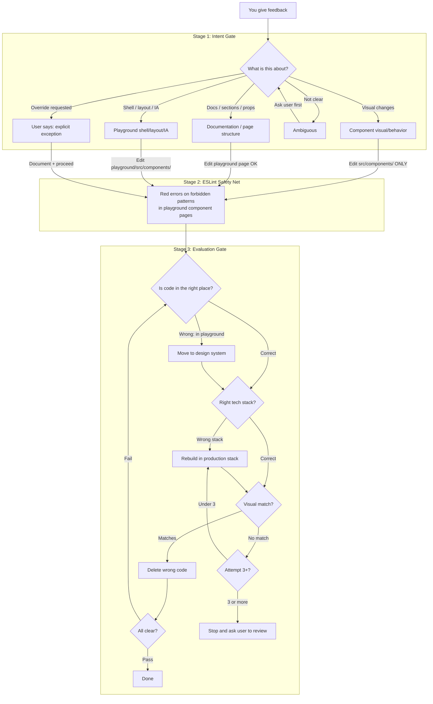

# Playground Code Enforcement Architecture (v3 -- post-audit-decisions)

## The Problem

Two failure modes:

1. **Misplaced code** -- agent builds visually correct code in the playground page (Tailwind) instead of the design system source (`src/`). You see the playground update and assume the codebase is fixed. It isn't.
2. **Misinterpreted intent** -- "this looks wrong in the playground" means "fix the design system component," but the agent edits the playground page instead.

This plan implements a **three-stage pipeline**: intent gate upstream, ESLint safety net during coding, evaluation gate + correction loop after coding.

---

## Architecture: Three-Stage Pipeline




---

## Stage 1: Intent Gate (upstream -- central guardrail in AGENTS.md)

**Critical change from v2:** The Intent Gate lives in `AGENTS.md` as a **top-level guardrail**, not just inside the playground skill. This means every path -- design-iteration, engineering-iteration, direct playground work -- must pass through it. No skill can bypass it.

**Implementation location:** `AGENTS.md` Engineering guardrails section, as a new numbered hard guardrail. The playground skill and rule get a cross-reference to this guardrail (not a duplicate copy).

**Three categories:**

- **Component visual** (colors, spacing, sizing, states, animations, interaction behavior) -- Edit `src/components/ui/` or `src/components/` ONLY. Never the playground page. Examples: "the button padding looks wrong," "this card needs a border," "the hover state is off"
- **Documentation / page structure** (reordering demo sections, updating props table data, changing code examples, adding new sections, creating a new page as part of Cross-App Parity) -- Edit `playground/src/app/components/*/page.tsx`. This is legitimate. Examples: "add a new section to the button page," "update the props table," "the code example is wrong"
- **Shell** (sidebar layout, how ComponentPreview renders, playground-wide IA, theme behavior) -- Edit `playground/src/components/` or `playground/src/app/layout.tsx`. Examples: "rearrange the sidebar categories," "change how the props table component works"

**Template page rule:** The reference implementation (`button/page.tsx`) allows Documentation / page structure edits (props table updates, code examples, section text). Only Component visual changes are blocked -- same as every other playground page.

**Default behavior:** Component visuals NEVER go to playground pages. Changes go to design system source. Playground auto-updates via `@ds/*` imports.

**Cross-App Parity is pre-approved:** Creating a new playground page as part of the Parity Checklist falls under "Documentation / page structure." No exception needed.

**Ambiguous prompts:** Agent MUST ask before proceeding.

**Route #9 scope expansion:** Currently only covers `playground/src/app/components/`. Expand to include `playground/src/components/` and `playground/src/app/layout.tsx` so Shell edits also trigger skill reading.

**Exception protocol:**

1. Agent acknowledges the exception
2. Agent documents the reason and scope (which file, why)
3. Agent proceeds with the edit
4. Exception is noted in the session

**Files to modify:**

- [AGENTS.md](AGENTS.md) -- Add new Engineering hard guardrail (central Intent Gate) + expand Route #9 scope
- [.cursor/skills/playground/SKILL.md](.cursor/skills/playground/SKILL.md) -- Add cross-reference to the central guardrail (not a duplicate)
- [.cursor/rules/playground-components.md](.cursor/rules/playground-components.md) -- Add cross-reference to the central guardrail

---

## Stage 2: ESLint Safety Net (during coding)

**Rules scoped to `playground/src/app/components/`** only.**

**Key change from v2:** Install `eslint-plugin-tailwindcss` for accurate Tailwind class detection. This plugin understands `className` JSX attributes and can reliably distinguish real class usage from code-example strings.

### Rules


| Rule                        | What it catches                                 | Allowlist (NOT flagged)                                                                                                                                  | Mechanism                                                            |
| --------------------------- | ----------------------------------------------- | -------------------------------------------------------------------------------------------------------------------------------------------------------- | -------------------------------------------------------------------- |
| No direct Radix imports     | `import from "@radix-ui/*"`                     | None -- always banned                                                                                                                                    | `no-restricted-imports` (stock ESLint)                               |
| No `<style>` tags           | `<style>{...}</style>`                          | None -- always banned                                                                                                                                    | `no-restricted-syntax` (stock ESLint)                                |
| No inline style attributes  | `style={{}}` on most elements                   | Allowed on: `<svg>` elements; also when only properties are `transform`, `opacity`, or `animationPlayState`                                              | `no-restricted-syntax` with AST selector (stock ESLint)              |
| No Tailwind default palette | `bg-red-500`, `text-blue-400` etc. in className | Allowed: `bg-neutral-900`, `bg-neutral-800`, `bg-white`, `bg-black` (backdrop containers); semantic tokens (`bg-accent/20`, `bg-muted`, `border-border`) | `eslint-plugin-tailwindcss` with `classnames-order` or custom config |


### Why these allowlist items exist

- `style` on `<svg>`: Chevron rotations, icon transforms. Dynamic values driven by React state. Present in `expand-collapse/page.tsx` line 26.
- `bg-neutral-900/800`: Dark backdrop containers. Present in `button/page.tsx` line 121.
- `bg-white`: Light backdrop containers (forced white regardless of dark mode). Present in `button/page.tsx` line 131.
- `bg-black`: Counterpart to `bg-white` for forced-black surfaces.
- Semantic tokens with opacity (`bg-accent/20`, `border-border`): These ARE design system tokens via Tailwind theme integration.

### New dependency

- `eslint-plugin-tailwindcss` -- install at root `package.json`

### File to modify

- [eslint.config.mjs](eslint.config.mjs) -- Add scoped override block with all four rules
- Root `package.json` -- Add `eslint-plugin-tailwindcss` dev dependency

---

## Stage 3: Evaluation Gate + Correction Loop (after implementation, max 3 attempts)

Same as v2. "Right tech stack" means whatever the production component already uses, not hardcoded "SCSS + Radix."

**The loop (max 3 iterations):**

```
AFTER the agent finishes writing code:

1. PLACEMENT CHECK: Is the code in the right place?
   - If new component logic/styling was added to a playground page
     instead of the design system source
   --> MOVE: migrate the implementation to the correct src/ location

2. STACK CHECK: Is the code using the same tech stack as the production component?
   - Check what the production version uses (SCSS? Framer Motion? Radix? Pure CSS?)
   - If the new code uses a different stack (e.g., Tailwind instead of SCSS)
   --> REBUILD: rewrite using the production stack to match the visual result

3. QUALITY CHECK: Does the rebuilt code visually match?
   - If doesn't match AND attempt < 3 --> loop back to step 2
   - If doesn't match AND attempt >= 3 --> STOP and ask user to review

4. CLEANUP: Delete the wrong code

5. FINAL EVALUATION: Run full gate from step 1
   - If anything fails --> loop (counts toward 3-attempt cap)
   - If passes --> done
```

**File to modify:** [.cursor/skills/playground/SKILL.md](.cursor/skills/playground/SKILL.md)

---

## Pre-Existing Cleanup

**Changed from v2:** The `expand-collapse/page.tsx` raw `<button>` is now an explicit **allowlisted exception** rather than a cleanup target. The trigger is custom harness code with a rotating chevron that doesn't map cleanly to the Button API. The broader problem of playground harness elements not using the design system is a separate future task.

Remaining cleanup (replace raw `<button>` with `@ds/Button`):

- [playground/src/app/components/fade-in/page.tsx](playground/src/app/components/fade-in/page.tsx) (lines 15, 40) -- "Replay Animation" and "Replay Stagger" buttons
- [playground/src/app/components/mount-entrance/page.tsx](playground/src/app/components/mount-entrance/page.tsx) (line 14) -- "Replay Animation" button

These are simple text-only trigger buttons that map directly to `<Button size="sm" emphasis="subtle">Replay Animation</Button>`.

---

## Audit Issues Resolved (v2 + v3)


| #   | Issue                                                  | Resolution                                                                                                                |
| --- | ------------------------------------------------------ | ------------------------------------------------------------------------------------------------------------------------- |
| 1   | `bg-white` not in allowlist                            | **v3:** Added `bg-white` and `bg-black` to ESLint allowlist                                                               |
| 2   | `<button>` to `@ds/Button` swap breaks expand-collapse | **v3:** Expand-collapse raw button is an explicit allowlisted exception. Fade-in and mount-entrance still get cleaned up. |
| 3   | Tailwind palette rule unreliable with stock ESLint     | **v3:** Install `eslint-plugin-tailwindcss` for accurate class-name-level detection                                       |
| 4   | Design/engineering iteration skills bypass Intent Gate | **v3:** Intent Gate is a central guardrail in `AGENTS.md`, not just in the playground skill. All paths pass through it.   |
| 5   | Route #9 scope narrower than Shell category            | **v3:** Expand Route #9 to include `playground/src/components/` and `playground/src/app/layout.tsx`                       |
| 6   | Documentation category vs "never write button page"    | **v3:** Documentation changes to template page are allowed; only Component visual changes blocked                         |
| 7   | `lucide-react` not formally allowlisted                | Noted for future -- no action needed now                                                                                  |
| 8   | Root-only ESLint scoping fragility                     | Noted for future -- no action needed now                                                                                  |


---

## Summary


| Stage                | When                 | What happens                                                                                                                                                      | Hard-coded?                                                         |
| -------------------- | -------------------- | ----------------------------------------------------------------------------------------------------------------------------------------------------------------- | ------------------------------------------------------------------- |
| 1. Intent Gate       | Before any code      | Central guardrail in AGENTS.md. Three-category classification. Component visual = blocked from playground. Documentation + Shell = allowed. Ambiguous = ask user. | Agent instructions (AGENTS.md guardrail + cross-refs in skill/rule) |
| 2. ESLint Safety Net | While coding         | Red errors via stock ESLint rules + eslint-plugin-tailwindcss. Scoped to playground component pages. Allowlist for legitimate patterns.                           | Yes -- ESLint rules in eslint.config.mjs                            |
| 3. Evaluation Gate   | After coding         | Check placement + production stack match. Max 3 loops.                                                                                                            | Agent instructions (mandatory post-implementation protocol)         |
| Exception handling   | On explicit override | Document + proceed + note in session                                                                                                                              | Agent instructions                                                  |


