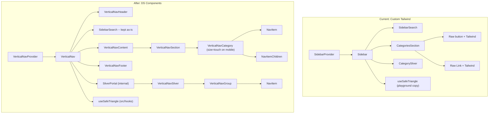

# Playground Shell Navigation -- DS Component Migration

## Current State

The playground sidebar ([playground/src/components/sidebar.tsx](playground/src/components/sidebar.tsx)) is a ~1000-line custom Tailwind implementation that duplicates most of the behavior already encoded in the DS components:

- **DS components:** `VerticalNav`, `VerticalNavProvider`, `VerticalNavHeader`, `VerticalNavContent`, `VerticalNavFooter`, `VerticalNavSection`, `VerticalNavGroup`, `VerticalNavCategory`, `VerticalNavSliver`, `NavItem`, `NavItemTrigger`, `NavItemChildren` (in [src/components/ui/VerticalNav/](src/components/ui/VerticalNav/) and [src/components/ui/NavItem/](src/components/ui/NavItem/))
- **Shell custom code:** `SidebarProvider`, `SidebarSearch`, `CategoriesSection`, `CategorySliver`, `MobileMenuButton`, `VersionLabel`, `Sidebar` -- all inline in one file with Tailwind classes

The shell has several features the DS does not yet support. This plan addresses them in dependency order across four phases.

## Gap Analysis Summary

| Shell Feature | DS Status | Phase |
|---|---|---|
| Category as direct link (`href` on category) | Missing -- `VerticalNavCategory` only renders `<button>` | Phase 1 |
| Route-change side effects (close mobile, dismiss sliver) | Missing -- DS has no router awareness | Phase 1 |
| Mobile touch-sized nav items | `NavItem` has `touch` size (44px) but `VerticalNavCategory` hardcodes `size="md"` | Phase 1 |
| Path-based active category derivation | Missing -- `active` is a dumb boolean | Phase 2 (consumer-side) |
| Collapse/expand toggle buttons | Missing -- `VerticalNavHeader` is a bare container | Phase 2 (consumer composes) |
| Mobile hamburger button | Missing -- no pre-built component | Phase 2 (consumer composes) |
| Pinned footer item with independent active state | Missing -- `VerticalNavFooter` is a bare container | Phase 2 (consumer composes) |
| Inline search with fuzzy-find | Missing entirely | Phase 4 (future) |
| Version branding in header | Consumer-side composition | Phase 2 (consumer composes) |

## Phase 1 -- DS Component Enhancements (prerequisites)

Fill the gaps in the design system that block migration. No playground changes yet (except demo page updates).

### 1a. Add `href` support to `VerticalNavCategory`

**Problem:** The shell has "direct link" categories (e.g., Overview with `href: "/"`, no children). `VerticalNavCategory` only renders a `<button>` -- there is no way to express a leaf category that navigates.

**Solution:** Add optional `href` and `as` props to `VerticalNavCategory`. When `href` is provided and `children`/`sliverContent` are empty, render via `NavItem` as a link instead of a button. When hovered, dismiss any open sliver (call `handleCategoryHover("")`).

**Files to edit:**
- [src/components/ui/VerticalNav/VerticalNav.tsx](src/components/ui/VerticalNav/VerticalNav.tsx) -- `VerticalNavCategoryProps` interface + `VerticalNavCategory` component (lines 366-460)

```tsx
export interface VerticalNavCategoryProps {
  // ...existing props
  href?: string;
  as?: ElementType;
}
```

When `href` is set, render:
```tsx
<NavItem
  as={as}
  href={href}
  icon={icon}
  size={size}
  active={active}
  activeAppearance="brand"
  collapsed={isCollapsedDesktop}
  disabled={disabled}
  onMouseEnter={() => handleCategoryHover("")}
>
  {label}
</NavItem>
```

### 1b. Add `onNavigate` callback to `VerticalNavProvider`

**Problem:** The shell closes the mobile drawer, cancels pending safe-triangle hovers, and dismisses slivers on route change. The DS has no hook point for this.

**Solution:** Add a `notifyNavigate()` function exposed via the `useVerticalNav()` hook. When called, it triggers: `setMobileOpen(false)` + `setOpenCategory(null)` + `cancelPending()`. The consumer calls `notifyNavigate()` inside a `useEffect` on `pathname`.

**Implementation detail:** `notifyNavigate` needs to reach inside the `SliverContext` (which lives in `VerticalNav`, not `VerticalNavProvider`). Two options:
- Option A: Lift `cancelPending` into `VerticalNavContext` so the provider can call it
- Option B: Have `VerticalNav` register a cleanup callback into the provider context on mount

Option A is simpler -- the provider stores an optional `onNavigate` ref that `VerticalNav` populates on mount with the full cleanup sequence.

**Files to edit:**
- [src/components/ui/VerticalNav/VerticalNav.tsx](src/components/ui/VerticalNav/VerticalNav.tsx) -- `VerticalNavContextValue`, `VerticalNavProvider`, `VerticalNav`, `useVerticalNav`

### 1c. Expose `size` prop on `VerticalNavCategory` and auto-switch to `touch` on mobile

**Problem:** `NavItem` already has a `touch` size (44px min-height, Apple HIG tap target) defined in [src/components/ui/NavItem/NavItem.module.scss](src/components/ui/NavItem/NavItem.module.scss) (lines 166-178) and accepted via the `NavItemSize` type. However, `VerticalNavCategory` hardcodes `size="md"` on line 438 of [src/components/ui/VerticalNav/VerticalNav.tsx](src/components/ui/VerticalNav/VerticalNav.tsx) and does not expose a `size` prop.

**Solution:** Two changes:
1. Add an optional `size` prop to `VerticalNavCategoryProps` (default `"md"`)
2. Inside `VerticalNavCategory`, when `isMobile` is true, override `size` to `"touch"` regardless of what was passed -- mobile nav must always meet the 44px tap target

```tsx
export interface VerticalNavCategoryProps {
  // ...existing props
  size?: NavItemSize;
}

// Inside VerticalNavCategory:
const effectiveSize = isMobile ? "touch" : (size ?? "md");
// Pass effectiveSize to <NavItem size={effectiveSize} ...>
```

This also applies to the direct-link branch from Phase 1a -- both the button and link paths must use `effectiveSize`.

**Note on child NavItems:** The `NavItem` elements inside slivers and mobile accordions are rendered by the consumer, not by `VerticalNavCategory`. The consumer can pass `size="touch"` to those `NavItem`s directly. Alternatively, a `VerticalNavSizeContext` could be added so all descendant `NavItem`s inherit the mobile size -- but that is a convenience optimization, not a blocker for Phase 2.

**Files to edit:**
- [src/components/ui/VerticalNav/VerticalNav.tsx](src/components/ui/VerticalNav/VerticalNav.tsx) -- `VerticalNavCategoryProps` + `VerticalNavCategory`

### 1d. Update playground demo page

After all Phase 1 DS enhancements, update the playground's vertical-nav demo page to document:
- The new `href` / `as` props on `VerticalNavCategory`
- The `notifyNavigate()` function from `useVerticalNav()`
- The `size` prop with automatic `touch` override on mobile
- A demo showing a direct-link category alongside expandable categories

**Files to edit:**
- [playground/src/app/components/vertical-nav/page.tsx](playground/src/app/components/vertical-nav/page.tsx)

---

## Phase 2 -- Migrate Shell Structure

Replace the shell's custom sidebar with DS components. The search widget stays as a custom component embedded in a slot.

### 2a. Replace `SidebarProvider` with `VerticalNavProvider`

**Layout change in** [playground/src/app/layout.tsx](playground/src/app/layout.tsx):
```tsx
// Before
import { SidebarProvider } from "@/components/sidebar";
<SidebarProvider>{children}</SidebarProvider>

// After
import { VerticalNavProvider } from "@ds/VerticalNav";
<VerticalNavProvider>{children}</VerticalNavProvider>
```

### 2b. Rewrite `Sidebar` component to compose DS primitives

Replace the entire `Sidebar()` function in [playground/src/components/sidebar.tsx](playground/src/components/sidebar.tsx) with:

```
VerticalNav
  VerticalNavHeader       -- logo, version label, collapse toggle (consumer-composed)
  SidebarSearch           -- KEPT AS-IS (custom component, Phase 4 future)
  VerticalNavContent
    VerticalNavSection label="Foundations"
      VerticalNavCategory href="/" ...   -- direct link (Phase 1a)
      VerticalNavCategory id="tokens" ... sliverContent={...}
    VerticalNavSection label="Components"
      VerticalNavCategory id="base" ... sliverContent={...}
      ...
  VerticalNavFooter
    NavItem href="/archive" ...           -- pinned footer link
```

**Key composition details:**
- `SidebarSearch` stays as a custom component, rendered between `VerticalNavHeader` and `VerticalNavContent`. It reads `collapsed` from `useVerticalNav()` instead of the old `useSidebar()`.
- Active state: a `useEffect` on `usePathname()` calls `notifyNavigate()` (from Phase 1b). Active category is computed via the existing `getCategoryForPath()` helper and passed as `active` to each `VerticalNavCategory`.
- Collapse toggle: composed inside `VerticalNavHeader` using `Button` from `@ds/Button` and `useVerticalNav().setCollapsed`.
- `MobileMenuButton` stays as an export, but now calls `useVerticalNav().setMobileOpen()`.
- The `VerticalNavSliverRegistry` must be set up with a `Map<string, ReactNode>` where each entry maps a category `id` to its `VerticalNavSliver` content (groups + NavItems).

### 2c. Replace sliver link rendering

The shell's `renderLinksWithGroups()` (lines 512-551) renders raw `<Link>` + Tailwind classes. Replace with `VerticalNavGroup` + `NavItem` from DS:

```tsx
<VerticalNavSliver label="Base">
  <VerticalNavGroup label="Action">
    <NavItem as={Link} href="/components/button" icon={<Square />}
             active={pathname === "/components/button"} activeAppearance="brand">
      Button
    </NavItem>
  </VerticalNavGroup>
  <VerticalNavGroup label="Display">
    <NavItem as={Link} href="/components/badge" icon={<Tag />} ...>Badge</NavItem>
    ...
  </VerticalNavGroup>
</VerticalNavSliver>
```

### 2d. Delete dead code

After migration, remove:
- The old `SidebarContext` / `SidebarProvider` / `useSidebar()`
- `CategoriesSection` component
- `CategorySliver` component
- The playground-local `useSafeTriangle` hook ([playground/src/hooks/use-safe-triangle.ts](playground/src/hooks/use-safe-triangle.ts)) -- the DS VerticalNav uses the canonical one from `src/hooks/`
- [playground/src/components/sidebar.module.css](playground/src/components/sidebar.module.css) -- the `.sectionLabel` / `.groupLabel` styles are now handled by `VerticalNav.module.scss`

---

## Phase 3 -- Visual Parity Verification

After migration, verify visual and behavioral parity between the old shell and the new DS-based shell.

**Checklist:**
- Expanded state: logo + version + search + categories + footer all render correctly
- Collapsed state: icons centered, tooltips on hover, section rules instead of labels
- Sliver flyout: hover-to-reveal works, safe-triangle protection, escape dismisses
- Mobile: hamburger opens overlay, backdrop click closes, category accordion works, nav items render at `touch` size (44px)
- Active state: parent category shows brand color when child page is active
- Route changes: mobile closes, sliver dismisses, active state updates
- Search: still works in both expanded and collapsed modes (untouched in Phase 2)
- Dark mode: all DS tokens respond to theme toggle

---

## Phase 4 -- Future: Search Component (out of scope)

Build a `VerticalNavSearch` DS component to replace the custom `SidebarSearch`. This is explicitly deferred and will be its own design system component initiative. Requirements to capture:

- Fuzzy search with configurable data source
- Keyboard navigation (arrow keys, Enter, Escape)
- Global shortcut support (Cmd+K)
- Two render modes: inline dropdown (expanded) and portal flyout (collapsed)
- Result items with icon, label, and section metadata
- Integration with `useVerticalNav()` for collapsed state awareness

When `VerticalNavSearch` ships, Phase 4 is a simple swap of `SidebarSearch` for the DS component.

---

## Architecture: Before vs After



## Risk Mitigation

- **Turbopack HMR unreliability:** Follow the mandatory flush-and-restart protocol after every edit (kill server, delete `.next`, restart, curl-verify).
- **SCSS vs Tailwind style conflicts:** The DS components use SCSS modules with scoped class names. The remaining Tailwind in `SidebarSearch` coexists without conflict because SCSS modules are hashed.
- **Regression surface:** The sidebar is the single most-used UI element in the playground. Phase 3's verification checklist is mandatory, not optional.
